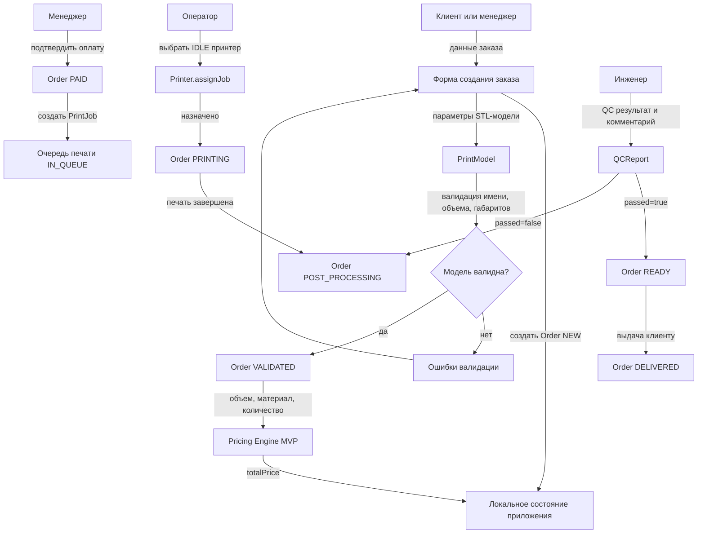

# MVP PrintFlow для PrintPub Irkutsk

## 1. Контекст проекта

PrintPub Irkutsk - сервисный центр 3D-печати в Иркутске. Целевая бизнес-архитектура из презентации описывает автоматизированный производственный цикл: прием заказа, валидация 3D-модели, расчет стоимости, слайсинг, печать, пост-обработка и выдача. C4-артефакт описывает целевую ИС PrintFlow с веб-порталом, сервисом заказов, слайсером, мониторингом, очередью печати, БД, файловым хранилищем и интеграциями с платежами/CRM.

Текущий репозиторий - базовый React-проект. В коде уже заведены доменные модели:

- `Order` со статусами жизненного цикла заказа.
- `PrintModel` для STL-модели, объема и габаритов.
- `Printer` для принтера и его статуса.
- `PrintJob` для задания печати и привязки к принтеру.
- `QCReport` для контроля качества.

MVP должен доказать основной производственный поток и дать сотрудникам минимальный инструмент управления заказами без тяжелой инфраструктуры целевой версии.

## 2. Цель MVP

Собрать базовый веб-прототип PrintFlow, который позволяет:

- принять заказ на 3D-печать с параметрами модели;
- провалидировать модель по формальным ограничениям;
- рассчитать предварительную стоимость;
- провести заказ по основным статусам производства;
- поставить задание в очередь и назначить его на доступный принтер;
- зафиксировать результат контроля качества и готовность к выдаче.

Главный критерий MVP: один заказ должен проходить весь путь от создания до готовности к выдаче в интерфейсе, с понятным состоянием на каждом шаге.

## 3. Роли MVP

### Клиент

- создает заявку;
- указывает контактные данные;
- добавляет STL-файл или его имитацию в прототипе;
- видит расчет стоимости и текущий статус заказа.

### Менеджер

- видит список заказов;
- проверяет параметры модели;
- подтверждает заказ и стоимость;
- переводит заказ в оплату/очередь.

### Оператор принтеров

- видит очередь печати;
- видит парк принтеров и их статусы;
- назначает задание на свободный принтер;
- переводит заказ в печать и пост-обработку.

### Инженер пост-обработки

- фиксирует результат QC;
- добавляет комментарий по качеству;
- переводит заказ в статус `READY` или возвращает на доработку.

## 4. Функциональные требования MVP

### FR-01. Создание заказа

Система должна позволять создать заказ с минимальным набором данных:

- имя клиента;
- телефон или email;
- название/описание изделия;
- имя файла модели;
- материал;
- цвет;
- объем модели в см3;
- габариты X/Y/Z в мм;
- количество экземпляров.

Для первой версии загрузка настоящего STL может быть заменена выбором/вводом имени файла и параметров модели вручную. Это сохранит предметный поток без блокировки на 3D-парсинге.

### FR-02. Валидация модели

Система должна проверять:

- наличие имени файла;
- расширение `.stl`;
- положительный объем;
- положительные габариты;
- попадание габаритов в рабочую область выбранного или стандартного принтера.

Результат валидации должен быть виден менеджеру и клиенту.

### FR-03. Расчет предварительной стоимости

Система должна рассчитывать стоимость по простой MVP-формуле:

```text
стоимость = объем_см3 * тариф_материала * количество + фиксированная_подготовка
```

На старте достаточно тарифов для PLA, PETG и ABS. Расчет должен сохраняться в заказе как `totalPrice`.

### FR-04. Управление статусами заказа

Система должна поддерживать основной жизненный цикл:

```text
NEW -> VALIDATING -> VALIDATED -> PAID -> IN_QUEUE -> PRINTING -> POST_PROCESSING -> READY -> DELIVERED
```

Для MVP оплата может быть ручной: менеджер нажимает "Оплата подтверждена", без интеграции с ЮKassa/Сбербанком.

### FR-05. Очередь печати

После подтверждения оплаты система должна создавать `PrintJob` и помещать заказ в очередь. Оператор должен видеть:

- идентификатор заказа;
- модель;
- материал;
- приоритет;
- расчетную стоимость;
- текущий статус.

### FR-06. Управление принтерами

Система должна показывать список принтеров с состояниями:

- `IDLE`;
- `PRINTING`;
- `MAINTENANCE`;
- `ERROR`;
- `OFFLINE`.

Оператор должен иметь возможность назначить задание только на принтер со статусом `IDLE`.

### FR-07. Контроль качества

Инженер должен иметь возможность создать QC-отчет:

- результат: пройдено/не пройдено;
- комментарий;
- ссылка на фото или текстовое поле-заглушка для будущей загрузки фото.

Если QC пройден, заказ переходит в `READY`. Если нет - возвращается в `POST_PROCESSING` с комментарием.

### FR-08. Просмотр заказов

Система должна показывать:

- список всех заказов;
- карточку/детали заказа;
- текущий статус;
- данные модели;
- стоимость;
- назначенный принтер;
- QC-результат.

### FR-09. Локальное хранение данных

Для MVP допускается хранение состояния в памяти React или `localStorage`. Это позволит быстро собрать демонстрационный поток. Позже этот слой заменяется API, БД и файловым хранилищем из C4-архитектуры.

## 5. Не входит в MVP

- реальная авторизация и разделение прав;
- реальный upload и парсинг STL через Three.js/Trimesh;
- интеграция с платежной системой;
- интеграция с CRM;
- Kafka или другой брокер сообщений;
- MinIO/S3;
- генерация реального G-code через Cura Engine;
- телеметрия физических принтеров;
- Prometheus/Grafana;
- доставка и логистика;
- полноценная бухгалтерия.

Эти элементы остаются в целевой архитектуре, но для базового MVP заменяются ручными действиями и локальными данными.

## 6. Базовый вариант работы MVP

1. Клиент или менеджер создает заказ в веб-интерфейсе.
2. Система создает `Order` со статусом `NEW`.
3. Клиент/менеджер вводит параметры STL-модели.
4. Система создает `PrintModel` и запускает формальную валидацию.
5. При ошибках заказ остается в `VALIDATING`, интерфейс показывает причины.
6. При успехе заказ переходит в `VALIDATED`.
7. Система рассчитывает предварительную стоимость и записывает ее в `Order.totalPrice`.
8. Менеджер вручную подтверждает оплату, заказ переходит в `PAID`.
9. Система создает `PrintJob`, заказ переходит в `IN_QUEUE`.
10. Оператор выбирает свободный принтер и назначает задание.
11. Принтер переходит в `PRINTING`, заказ переходит в `PRINTING`.
12. Оператор завершает печать, заказ переходит в `POST_PROCESSING`.
13. Инженер заполняет `QCReport`.
14. При успешном QC заказ переходит в `READY`.
15. После выдачи клиенту заказ переводится в `DELIVERED`.

## 7. Dataflow MVP



## 8. Состояния данных

### Order

Минимальные поля MVP:

- `id`;
- `customerName`;
- `customerContact`;
- `status`;
- `createdAt`;
- `totalPrice`;
- `models`;
- `qcReport`;
- `assignedPrinterId`;
- `printJobId`.

### PrintModel

Минимальные поля MVP:

- `id`;
- `fileName`;
- `stlPath`;
- `volume_cm3`;
- `size`;
- `material`;
- `color`;
- `quantity`;
- `validationErrors`.

### PrintJob

Минимальные поля MVP:

- `jobID`;
- `orderId`;
- `modelId`;
- `gcodePath`;
- `startTime`;
- `priority`;
- `printer`.

В MVP `gcodePath` может быть технической заглушкой, например `mock://gcode/{jobID}.gcode`.

### Printer

Минимальные поля MVP:

- `id`;
- `modelName`;
- `status`;
- `nozzleTemp`;
- `bedTemp`;
- `buildVolume`.

### QCReport

Минимальные поля MVP:

- `reportId`;
- `isPassed`;
- `comments`;
- `photoUrl`;
- `createdAt`.

## 9. Рекомендуемый интерфейс MVP

Первая версия SPA может состоять из одного рабочего экрана с вкладками:

- "Новый заказ" - форма создания заказа и расчет.
- "Заказы" - таблица/список заказов с фильтром по статусу.
- "Очередь" - задания печати и назначение на принтер.
- "Принтеры" - состояние парка.
- "QC" - заказы на пост-обработке и форма отчета качества.

Такой интерфейс покрывает основной производственный контур и соответствует уже созданным доменным моделям.

## 10. Минимальный план реализации

### Этап 1. Доменная логика

- расширить модели недостающими MVP-полями;
- добавить тарифы материалов;
- добавить функцию расчета стоимости;
- добавить функцию формальной валидации модели;
- добавить seed-данные для 19 принтеров или сокращенного демо-парка.

### Этап 2. React-интерфейс

- заменить стартовый экран CRA на рабочее приложение PrintFlow;
- добавить вкладки или простую навигацию;
- реализовать форму заказа;
- реализовать список заказов и действия по статусам;
- реализовать очередь и назначение принтера;
- реализовать QC-форму.

### Этап 3. Сохранение и демонстрация

- подключить `localStorage`;
- добавить демо-данные;
- добавить базовые тесты доменной логики;
- обновить README инструкциями запуска и описанием MVP.

## 11. Критерии готовности MVP

MVP считается готовым, если:

- заказ можно создать из интерфейса;
- невалидная модель не проходит дальше;
- валидная модель получает расчет стоимости;
- заказ проходит статусы до `DELIVERED`;
- задание можно назначить только на свободный принтер;
- QC-результат влияет на дальнейший статус;
- данные не пропадают после перезагрузки страницы;
- README объясняет, как запустить и проверить базовый поток.

